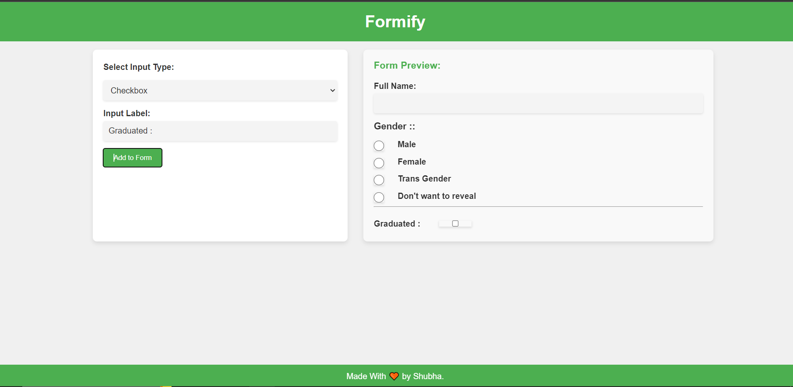

# Form-Builder

- A form builder that allows users to add different types of input fields dynamically. Include options for text inputs, checkboxes, and radio buttons. Each added field displayed in a preview area.

# Live Link
- https://formify-five.vercel.app/
# UI
-

